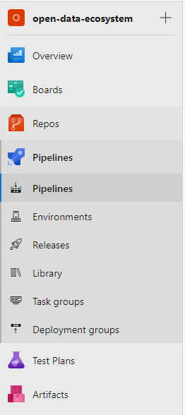
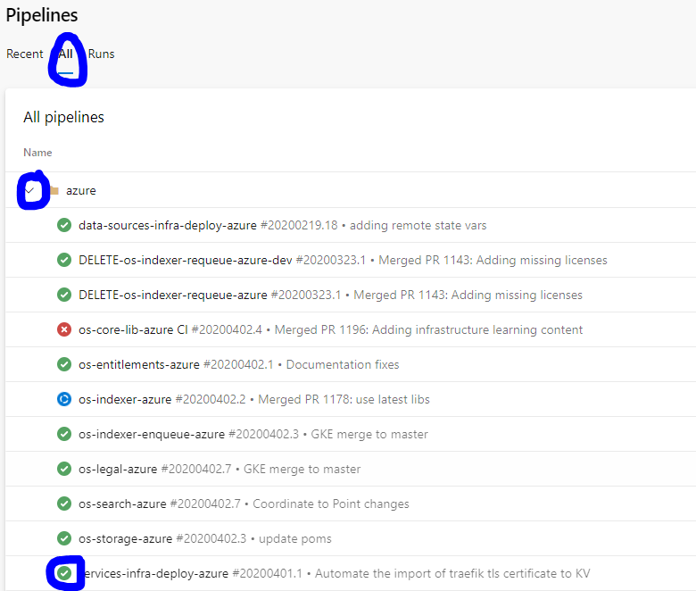
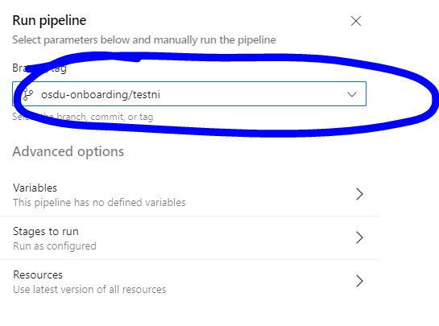

# Introduction

_A presentation of this material was given on April 2, 2020. 
A recording of that recording is available [here](https://microsoft.sharepoint.com/:v:/t/SLBMicros/EZNKoQHOnmZDo8BE2KbK1NwBAe-QDfSu73H8yD0c6lFrPA?e=9GaNDa), [here](https://microsoft.sharepoint.com/:v:/t/OSDU-WiproandMicrosoft/EdnTrBCP9ZlGsxQoneSZ_M8B01F7Ln4Xd0lLChlTm8DJ2Q?e=IptZOw) and [here](https://msit.microsoftstream.com/video/e868a1ff-0400-86e8-5f30-f1ea75308133), depending on your organization.
Note: the material, as it appears here, may have diverged from the material 
as it appeared at the time of the recording._

The purpose of this guide is to:
 - Gain hands on experience modifying the OSDU R2 Azure infrastructure deployments pipeline
 - Deploy the infrastructure for OSDU R2 Azure services into a new stage
 - Understanding the variable groups needed to deploy into a new stage
 - Creating a variable group needed to deploy into a new stage
 - Trigger an infrastructure deployment into a new stage
 - Cleaning up the environment when finished with it.

This guide assumes that the reader has:
 - experience with [Git](https://git-scm.com/downloads)
 - access to the Azure DevOps project [here](https://dev.azure.com/slb-des-ext-collaboration/open-data-ecosystem/)
 - generated a Personal Access Token (PAT) from Azure DevOps. See instructions [here](https://docs.microsoft.com/en-us/azure/devops/organizations/accounts/use-personal-access-tokens-to-authenticate?view=azure-devops&tabs=preview-page).
 - experience with [Pipelines in Azure DevOps](https://docs.microsoft.com/en-us/azure/devops/pipelines/get-started/key-pipelines-concepts?view=azure-devops)

 This guide will utilize the software below:
 - [Git](https://git-scm.com/)
 - An IDE or text editor of your choice

> Note: Just getting started with infrastructure deployments? You may want to read through the [Getting Started](./03_INFRASTRUCTURE_DEPLOYMENTS_GETTING_STARTED.md) document first!

## Local Developer Tooling Set-Up

**Intalling Dependencies**

If you do not have `Git` installed on your maching, you can follow the [installation](https://git-scm.com/book/en/v2/Getting-Started-Installing-Git) guide to configure it. If developing on Windows, it is recomended to develop using [WSL 2.0](https://docs.microsoft.com/en-us/windows/wsl/wsl2-install) because it will more closely match the CI/CD environment. However, this is not necessary for the steps in this guide.

**Getting the code**

You will need to checkout the source code for the `infrastructure-templates` repository. The steps below show how you can do this on a Unix based OS (linux, mac, WSL).

> Note: You will likely need to configure your personal access token (PAT) in order to execute the `git pull`. Follow [these steps](https://docs.microsoft.com/en-us/azure/devops/organizations/accounts/use-personal-access-tokens-to-authenticate?view=azure-devops&tabs=preview-page#create-personal-access-tokens-to-authenticate-access) to create a PAT.

```bash
$ git clone https://slb-des-ext-collaboration@dev.azure.com/slb-des-ext-collaboration/open-data-ecosystem/_git/infrastructure-templates
$ cd infrastructure-templates
```

**Inspect repository**

Let's have a quick look around to understand the structure of this repository.

```bash
# abridged output
$ tree -d
.
├── design                          # project Cobalt design docs (https://github.com/microsoft/cobalt)
├── devops
│   ├── infrastructure              # OSDU R2 infrastructure pipelines + templates
│   └── service-pipelines           # OSDU R2 services pipeline templates
├── docs                            # project Cobalt documentation (https://github.com/microsoft/cobalt)
│   └── osdu                        # OSDU specific documentation
├── infra
│   ├── modules
│   │   └── providers
│   │       ├── azure               # Azure Terraform modules
│   │       └── elastic             # Elasticsearch  Terraform modules
│   └── templates
│       ├── az-hello-world
│       ├── az-micro-svc-kube-elastic-cloud     # OSDU R2 AKS deployment template (in progress as of 4/2/2020)
│       └── az-micro-svc-small-elastic-cloud    # OSDU R2 App Service deployment template (used as of 4/2/2020)
└── test-harness
    ├── infratests                  # test harness code + abstractions
    └── terratest-extensions        # extensions to Terratest for Azure dependencies
```

In this guide, we will modify the infrastructure pipeline (`devops/infrastructure/pipeline-env-managed-svc.yml`) in order to deploy the OSDU R2 infrastructure template (`infra/templates/az-micro-svc-small-elastic-cloud/`) to a new stage.


## Understanding the pipeline

Lets take a quick look at the current deployment pipeline so that we can understand some key concepts.

```bash
# abridged output. Line numbers added to help point out key concepts.
$ cat -n devops/infrastructure/pipeline-env-managed-svc.yml
...
    72  variables:
    73  - name: 'TF_VERSION'
    74    value: '0.12.20'
    75  - name: 'GO_VERSION'
    76    value: '1.12.14'
    77  - name: 'TF_ROOT_DIR'
    78    value: 'infra'
    79  - name: 'PIPELINE_ROOT_DIR'
    80    value: 'devops/infrastructure'
    81  - name: 'TEST_HARNESS_DIR'
    82    value: 'test-harness'
    83  - group: 'Infrastructure Pipeline Variables'
    84
    85  stages:
    86  - template: prepare-stage.yml
    87    parameters:
    88      environments:
    89      - name: 'devint'
    90        enablePrIsolation: false
    91        resourceNameIsolationLevel: 8
    92      - ${{ if eq(variables['Build.SourceBranchName'], 'master') }}:
    93        - name: 'qa'
    94          enablePrIsolation: false
    95          resourceNameIsolationLevel: 8
    96        - name: 'prod'
    97          enablePrIsolation: false
    98          resourceNameIsolationLevel: 8
    99
   100      configurations:
   101      - jobName: managed_svc
   102        terraformWorkspacePrefix: ADO
   103        terraformTemplatePath: infra/templates/az-micro-svc-small-elastic-cloud
   104        deploymentTimeoutInMinutes: 120
```

**Variable groups**
Lines `72 - 83` are defining variables and variable groups that are common to *all deployment stages*. You can find documentation on these [here](https://dev.azure.com/slb-des-ext-collaboration/open-data-ecosystem/_git/infrastructure-templates?path=/docs/osdu/INFRASTRUCTURE_DEPLOYMENTS.md&_a=preview).

Additional *stage specific* variable groups are going to be pulled in by the *release stage*. You can have a look for yourself by looking at the deploy template, located at `devops/infrastructure/deploy-stage.yml`.

```bash
cat -n devops/infrastructure/deploy-stage.yml | grep 'variables:' -A1
    47    variables:
    48    - group: 'Infrastructure Pipeline Variables - ${{ parameters.environment }}'
```

**YAML Templates**
Lines `85-104` are really important to how the overall pipeline operates. Here is an overview of what these lines do:

- `86`: The pipeline is configuring a [YAML template](https://docs.microsoft.com/en-us/azure/devops/pipelines/process/templates?view=azure-devops) called `prepare-stage.yml`. This template is responsible for orchestrating the whole deployment. You can find documentation on these [here](https://dev.azure.com/slb-des-ext-collaboration/open-data-ecosystem/_git/infrastructure-templates?path=/docs/osdu/INFRASTRUCTURE_DEPLOYMENTS.md&_a=preview). The template is located at `devops/infrastructure/prepare-stage.yml`.
- `88-98`: The `prepare-stage.yml` template requires `environments` to be configured. These map to the environments that will be deployed (in sequential order)
- `92`: This line is really important because it dictates that the deployment to `qa` and `prod` shall only happen if the build is happening for the `master` branch. This allows builds to non-master branches to be isolated to the `devint` environment.
- `100-104`: These lines dictate which template will be deployed, along with some more configuration values.

You can find documentation on the rest of the parameters [here](https://dev.azure.com/slb-des-ext-collaboration/open-data-ecosystem/_git/infrastructure-templates?path=/docs/osdu/INFRASTRUCTURE_DEPLOYMENTS.md&_a=preview)

## Adding a new deployment stage

For this challenge, we will configure a deployment to a **new stage** only if the build is occurring on a **particular branch**. Deploying to a **new stage** prevents distrupting existing deployments. Deploying only on a **particular branch** is helpful to understand the power of the YAML templating language.

### Step 1. Choose a unique identifier

You will need to choose a short identifier that is unique to you. For simplicity, this should be a 6 character long word containing only lowercase letters. For this example, I'll be using `testni`.

### Step 2. Checkout a branch

```bash
# branch name should contain your unique identifier (to make cleanup easier)
$ git checkout -b osdu-onboarding/testni
```

### Step 3. Modify the release pipeline

You will need to configure the pipeline located at `devops/infrastructure/pipeline-env-managed-svc.yml` to deploy under the conditions we set in the project. It should look something like this:

> Note: One very **important** thing to know about this. The `Build.SourceBranchName` variable is everything **after** the last `/` in your branch name. This can be confusing, but in the example it is just `testni` and not `osdu-onboarding/testni`.

```bash
# abridged output
$ cat -n devops/infrastructure/pipeline-env-managed-svc.yml
    85  stages:
    86  - template: prepare-stage.yml
    87    parameters:
    88      environments:
    89      - ${{ if eq(variables['Build.SourceBranchName'], 'testni') }}:      # note the branch check is against testni, not osdu-onboarding/testni
    90        - name: 'testni'                                                  # your identifier goes here!
    91          enablePrIsolation: false
    92          resourceNameIsolationLevel: 8
    93
    94      - ${{ if not(eq(variables['Build.SourceBranchName'], 'testni')) }}: # there is a change here as well
    95        - name: 'devint'
    96          enablePrIsolation: false
    97          resourceNameIsolationLevel: 8
```

### Step 4. Commit your code

```bash
$ git add devops/
$ git commit -m"Configuring new stage for OSDU onboarding training"
$ git push --set-upstream origin $(git branch --show-current)
```

### Step 5. Add the appropriate variable groups

We need to configure the specifics of the deployment for your new stage. To do this, we need to create two new variable groups:

- **`Infrastructure Pipeline Variables - $STAGE`** (i.e., `Infrastructure Pipeline Variables - testni`)
- **`Infrastructure Pipeline Secrets - $STAGE`** (i.e, `Infrastructure Pipeline Secrets - testni`)


The details of these variable groups are described [here](https://dev.azure.com/slb-des-ext-collaboration/open-data-ecosystem/_git/infrastructure-templates?path=%2Fdocs%2Fosdu%2FINFRASTRUCTURE_DEPLOYMENTS.md&_a=preview&anchor=variable-group-overview). For simplicity, we can clone the variable groups for `devint` as they are already configured correctly.

### Step 6. Trigger a deployment

Now that we have our pipeline configured to deploy the new stage and we have configured the appropriate variable groups, we can trigger a deployment. Let's hope it works :).

**Navigate to the correct pipeline**
- Select `Pipelines` pane in Azure DevOps



- View `All` and open the `Azure` folder. Select the `services-infra-deploy` pipeline



- Select `Run New`


- Select the correct branch



- Click `Run`


### Step 7. Wait for the deployment to finish and inspect resources in Azure

The deployment will take about 30 minutes to deply the first time because it needs to create all of the resources. Subsequent deployments will be much faster. A successful deployment will look like so:


Next, you can navigate to the Azure subscription where the deployment was executed, and look for a resource group that contains your unique identifier from *Step 1.*


### Step 8. Cleanup

The resources that you have provisioned for this challenge will be useful for the [Service Deployment into Azure](./05_AZURE_SERVICE_DEPLOYMENT.md). Once you have completed that lab, you can clean up your resources. When ready, please make sure to clean up the following:

- Your branch in `infrastructure templates` repository in Azure DevOps
- Your variable groups in Azure DevOps
- Your resource group in Azure


Congrats, you have completed the lab :)

## License
Copyright © Microsoft Corporation
Licensed under the Apache License, Version 2.0 (the "License");
you may not use this file except in compliance with the License.
You may obtain a copy of the License at
[http://www.apache.org/licenses/LICENSE-2.0](http://www.apache.org/licenses/LICENSE-2.0)
Unless required by applicable law or agreed to in writing, software
distributed under the License is distributed on an "AS IS" BASIS,
WITHOUT WARRANTIES OR CONDITIONS OF ANY KIND, either express or implied.
See the License for the specific language governing permissions and
limitations under the License.
